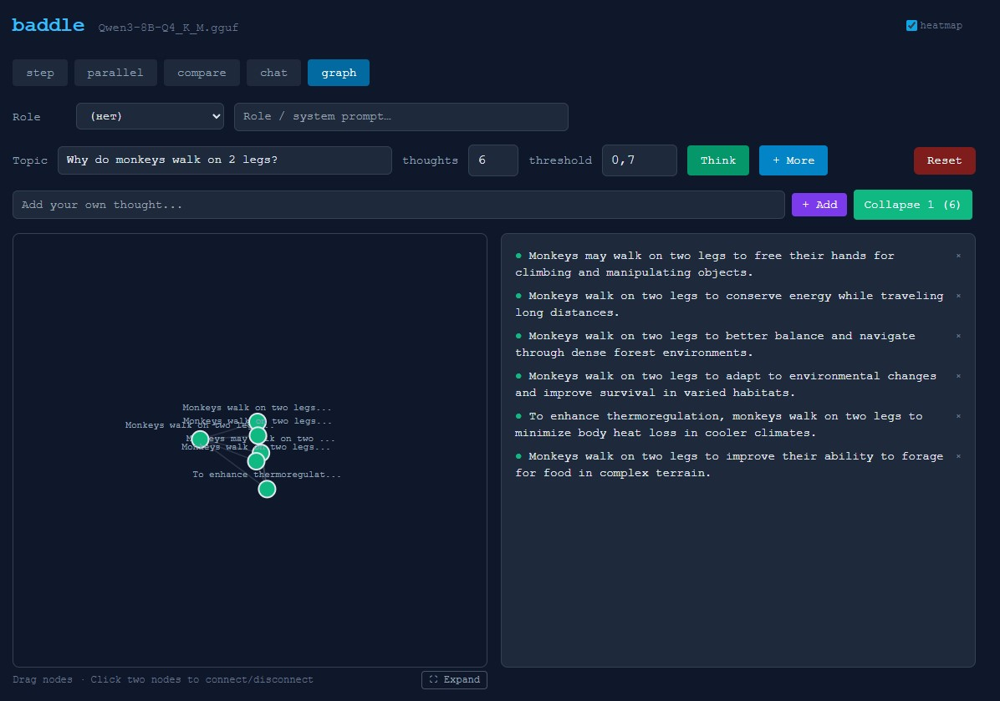
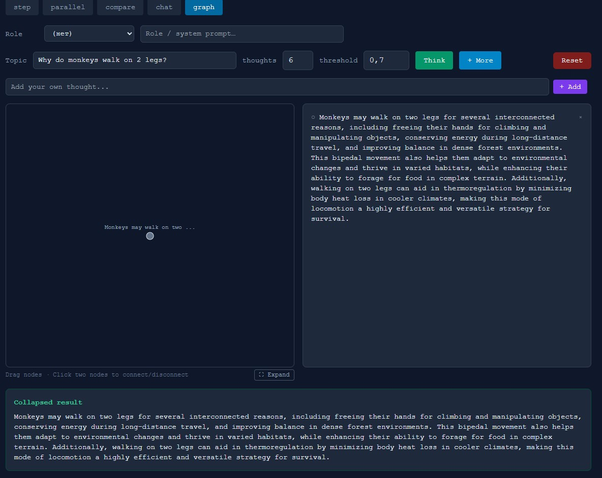
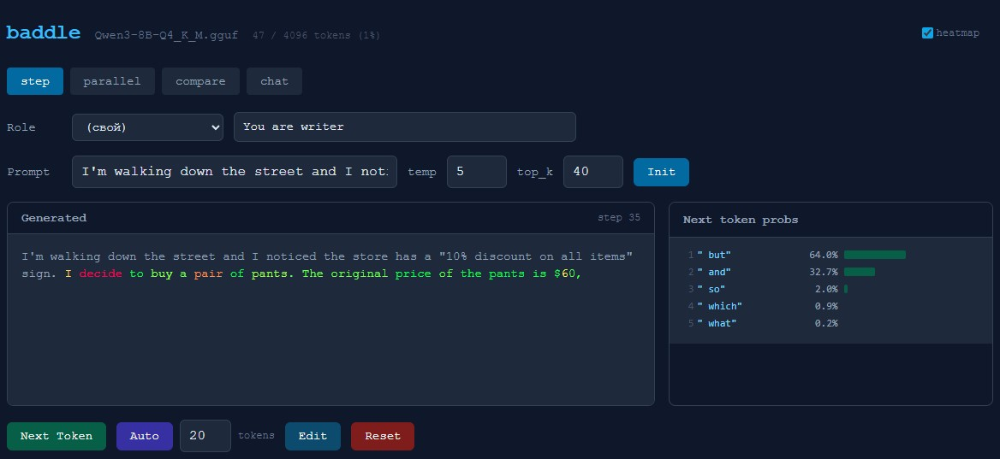
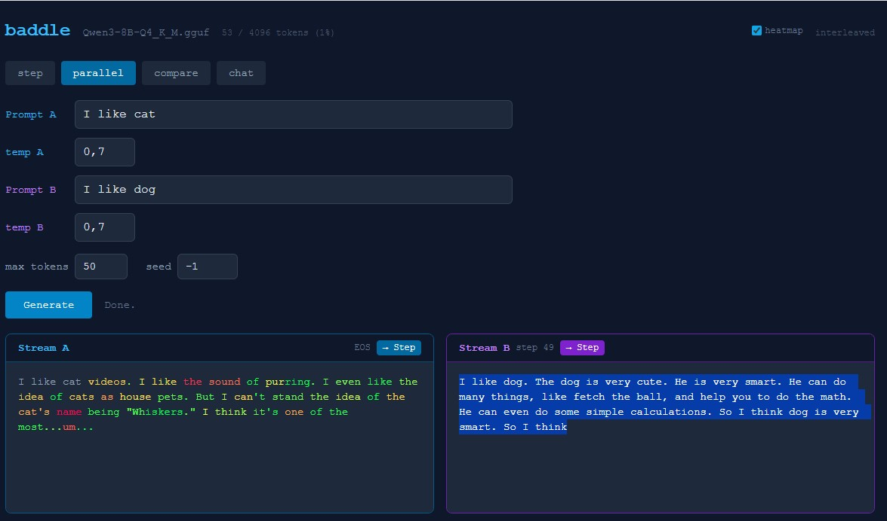
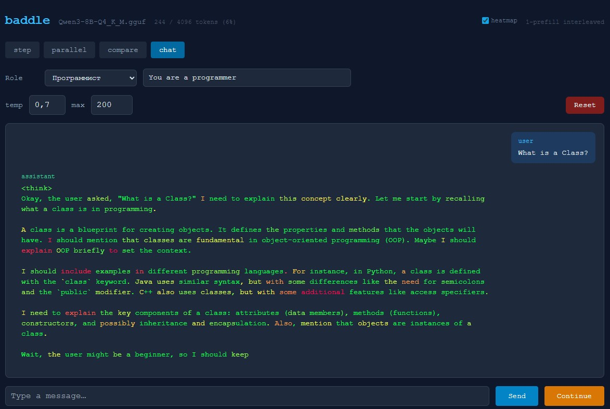

# baddle

> Не спрашивай у ИИ ответ — смотри, как он его строит, и управляй процессом.

**[English version →](README_EN.md)**

Человек мыслит не линейно. Он набрасывает точки — факты, гипотезы, ассоциации —
проверяет, можно ли их соединить, и если получается — углубляется. Если нет —
добирает новых точек или перестраивает связи.

Baddle воспроизводит этот процесс через LLM. Не чат-бот — здесь вы разветвляете
идеи, схлопываете кластеры, вмешиваетесь в генерацию на уровне отдельного токена.
Всё локально, через llama.cpp, без облаков.

**[Установка и запуск →](SETUP.md)**

---

## Режимы

### `graph` — граф мыслей

Ключевой режим. Вводишь тему — модель генерирует пачку коротких мыслей.
Между ними строятся связи по **cosine similarity на эмбеддингах** модели.
Похожие мысли соединяются, группируются в кластеры.

Два режима мышления, реализованные буквально:

- **Дивергентное** — Think генерирует пачку идей, Expand от узла порождает ответвления
- **Конвергентное** — Collapse схлопывает кластер в связный абзац, Elaborate углубляет конкретную мысль

**Цикл: генерация мыслей → граф связей → кластеризация → коллапс → повтор.** Каждый коллапс поднимает уровень абстракции.

**Интерфейс:**
- **Правый клик** на узле → контекстное меню (Expand / Elaborate / Edit / Delete)
- **Hover** → полный текст мысли
- **Drag** → перетаскивание узлов
- **Link mode** → кнопка включает режим связей, клик на два узла → соединить/разъединить (пунктиром)
- **Convex hull** — полупрозрачный контур вокруг кластеров
- **Collapsed-узлы** — квадратные, крупнее (визуально отличаются от обычных мыслей)
- **Рёбра** — толщина и прозрачность по силе связи
- **Scroll wheel** — зум графа, **drag по фону** — перемещение (pan)
- **Ctrl+Z** — undo, **Delete** — удалить узел, **Esc** — снять выделение
- **⟳ Layout** — пересчитать позиции узлов
- **↓ Save / ↑ Load** — экспорт/импорт графа в JSON (мысли, связи, позиции, кластеры)
- **temp / top_k** — настройка параметров генерации прямо в интерфейсе графа
- **threshold** — пересчёт связей и кластеров в реальном времени при изменении порога
- **Collapse ▾** — short (абзац) или long (развёрнутое эссе), custom (свой лимит токенов)
- **Collapse prompt** — пользовательская инструкция для коллапса ("сравни", "найди противоречия", "напиши план")
- **Collapse без схлопывания** — чекбокс "keep": генерирует текст, но оригинальные узлы остаются (для тестирования разных коллапсов)
- **Энтропия узлов** — heatmap по токенам в detail panel при клике на узел
- **→ Flow** — directed flow layout: узлы в колонках по глубине (Topic→Think→Expand→Elaborate). Переключатель свободный граф / поток
- **Source tracking** — при выделении узла видно от какой мысли он произошёл (фиолетовый "↳ from:")
- **Список мыслей** — отсортирован по кластерам, клик на текст выделяет узел на графе, клик на узел подсвечивает кластер в списке
- **Topic nodes** — корневые темы как полноценные узлы-ромбы (depth=-1), поддержка нескольких тем в одном графе, directed edges к дочерним мыслям
- **Веерная раскладка** — в свободном режиме кластеры занимают секторы, узлы не слипаются
- **✂ Select → Collapse / → Chat** — ручной выбор произвольных узлов, затем Collapse или отправка в чат как контекст
- **☐ All** — выбрать все узлы одной кнопкой
- **→ Chat с контекстом графа** — выбранные узлы передаются в чат как context (опция "structure" включает полную структуру: кластеры, связи, веса)
- **To Graph** — ручной ввод текста в граф без привязки, или отправка результата коллапса обратно в граф
- **seed** — воспроизводимость генерации в графовом режиме
- **Heatmap scale** — настраиваемая шкала энтропии рядом с галочкой heatmap

Работает только в in-process режиме (без `--server`).

---

### `step` — пошаговая генерация

Модель генерирует **один токен за раз**. После каждого токена видно
распределение вероятностей (top-10), можно сменить температуру и top_k
и продолжить генерацию.

Текст **редактируемый** — кнопка `Edit` включает правку, `Sync` применяет
изменения. Модель подхватит и продолжит оттуда.

Токены подсвечиваются **heatmap уверенности** — зелёный (модель уверена),
жёлтый, красный (высокая энтропия, модель гадает).

---

### `parallel` — два промпта одновременно

Два разных промпта генерируются параллельно. Live split-screen,
оба потока обновляются в реальном времени. Каждый поток имеет свои **temp** и **top_k**.

Чекбокс **compare** — один промпт, два набора параметров. Оба потока стартуют
из идентичных токенов и расходятся как только параметры дают разные выборки.
Badge показывает точный шаг расхождения.

С флагом `--server` оба промпта обрабатываются одновременно на GPU.

---

### `chat` — разговор с моделью

Чат через chat template (ChatML / Jinja2). Роли, температура, лимит токенов.
**Continue** догенерирует обрезанный ответ. Heatmap показывает уверенность.

**Context sidebar** — правая панель с контекстным буфером:
- Добавляй контекст из графа (→ Chat), из ответов модели (→ ctx), или вручную
- Каждый элемент можно включить/выключить или удалить
- Чекбокс **structure** — передаёт полную структуру графа (кластеры, связи, веса)
- **→ graph** — отправляй текст из чата в граф не переключая вкладку

---

### Гибридный режим: parallel/compare → step

Кнопка **→ Step** у каждого потока переключает в пошаговый режим с сохранением
текста и KV cache. Только в in-process режиме.

---

### Общие возможности

- **Heatmap уверенности** — во всех режимах токены окрашены по энтропии
- **Роли** — пресеты из `roles.json` (prefix в step/parallel/compare, system message в chat)
- **Язык** — переключатель EN/RU: роли, системные промпты (включая граф) на выбранном языке
- **Seed** — воспроизводимость результатов (parallel, compare)
- **Счётчик токенов** — использованные / доступные токены контекста
- **Settings** — выбор режима работы:
  - **Local** — всё на локальной модели (llama.cpp)
  - **API** — OpenAI-compatible API (GPT-4, Claude и др.) для графа и чата
  - **Hybrid** — роутинг по компонентам (например: graph через API, embeddings локально)
  - Подгрузка списка моделей из API, горячая смена локальной модели без перезапуска
  - Настройки сохраняются в `settings.json`
- **Similarity mode** — Embedding / Jaccard / Off. Auto-fallback на Jaccard при ошибке API

> ⚠️ **LM Studio**: включите опцию **"Only Keep Last JIT Loaded Model"** = OFF,
> иначе модель выгружается между chat и embedding запросами. Или используйте
> Jaccard similarity вместо Embedding — он не требует отдельного API-вызова.

- **Generation Studio** — универсальная модалка для генерации с выбором вариантов. Rephrase, Elaborate, Expand, Collapse — всё через Studio с настройками temp/top_k/max_tokens, пакетная генерация N вариантов, сравнение и применение лучшего

---

📄 [Видение и архитектура](VISION.md) · 📋 [TODO](TODO.md) · 📝 [Статья (взгляд AI)](Article/ARTICLE_AI_VIEW.md)
