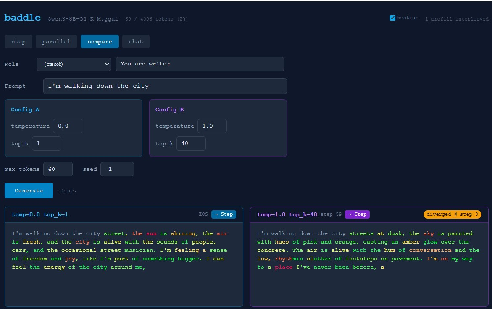

# baddle

> Не спрашивай у ИИ ответ — смотри, как он его строит, и управляй процессом.

**[English version →](README_EN.md)**

Человек мыслит не линейно. Он набрасывает точки — факты, гипотезы, ассоциации —
проверяет, можно ли их соединить, и если получается — углубляется. Если нет —
добирает новых точек или перестраивает связи.

Baddle воспроизводит этот процесс через LLM. Не чат-бот — здесь вы разветвляете
идеи, схлопываете кластеры, вмешиваетесь в генерацию на уровне отдельного токена.
Всё локально, через llama.cpp, без облаков.

**[Установка и запуск →](SETUP.md)**

---

## Режимы

### `graph` — граф мыслей

Ключевой режим. Вводишь тему — модель генерирует пачку коротких мыслей.
Между ними строятся связи по **cosine similarity на эмбеддингах** модели.
Похожие мысли соединяются, группируются в кластеры.

Два режима мышления, реализованные буквально:

- **Дивергентное** — Think генерирует пачку идей, Expand от узла порождает ответвления
- **Конвергентное** — Collapse схлопывает кластер в связный абзац, Elaborate углубляет конкретную мысль

**Цикл: генерация мыслей → граф связей → кластеризация → коллапс → повтор.** Каждый коллапс поднимает уровень абстракции.

**Интерфейс:**
- **Правый клик** на узле → контекстное меню (Expand / Elaborate / Edit / Delete)
- **Hover** → полный текст мысли
- **Drag** → перетаскивание узлов
- **Link mode** → кнопка включает режим связей, клик на два узла → соединить/разъединить (пунктиром)
- **Convex hull** — полупрозрачный контур вокруг кластеров
- **Collapsed-узлы** — квадратные, крупнее (визуально отличаются от обычных мыслей)
- **Рёбра** окрашены по силе связи: синий → жёлтый → зелёный
- **Scroll wheel** — зум графа, **drag по фону** — перемещение (pan)
- **Ctrl+Z** — undo, **Delete** — удалить узел, **Esc** — снять выделение
- **⟳ Layout** — пересчитать позиции узлов
- **↓ Save / ↑ Load** — экспорт/импорт графа в JSON (мысли, связи, позиции, кластеры)
- **temp / top_k** — настройка параметров генерации прямо в интерфейсе графа
- **threshold** — пересчёт связей и кластеров в реальном времени при изменении порога
- **Collapse ▾** — short (абзац) или long (развёрнутое эссе)
- **Энтропия узлов** — обводка узлов окрашена по уверенности модели (зелёный → жёлтый → красный). В списке мыслей и tooltip показывается средняя энтропия и процент неуверенных токенов
- **→ Flow** — directed flow layout: узлы выстраиваются слева направо по глубине (Think→Expand→Elaborate→Collapse). Тупиковые ветки затухают. Переключатель между свободным графом и потоком мышления
- **Source tracking** — при выделении узла видно от какой мысли он произошёл (фиолетовый "↳ from:")

Работает только в in-process режиме (без `--server`).

---

### `step` — пошаговая генерация

Модель генерирует **один токен за раз**. После каждого токена видно
распределение вероятностей (top-10), можно сменить температуру и top_k
и продолжить генерацию.

Текст **редактируемый** — кнопка `Edit` включает правку, `Sync` применяет
изменения. Модель подхватит и продолжит оттуда.

Токены подсвечиваются **heatmap уверенности** — зелёный (модель уверена),
жёлтый, красный (высокая энтропия, модель гадает).

---

### `parallel` — два промпта одновременно

Два разных промпта генерируются параллельно. Live split-screen,
оба потока обновляются в реальном времени.

С флагом `--server` оба промпта обрабатываются одновременно на GPU.

---

### `compare` — один промпт, два набора параметров

Один промпт, **два конфига** (температура, top_k, seed). Оба потока стартуют
из идентичных токенов и расходятся как только параметры дают разные выборки.
Badge показывает точный шаг расхождения.

---

### `chat` — разговор с моделью

Чат через chat template (ChatML / Jinja2). Роли, температура, лимит токенов.
**Continue** догенерирует обрезанный ответ. Heatmap показывает уверенность.

---

### Гибридный режим: parallel/compare → step

Кнопка **→ Step** у каждого потока переключает в пошаговый режим с сохранением
текста и KV cache. Только в in-process режиме.

---

### Общие возможности

- **Heatmap уверенности** — во всех режимах токены окрашены по энтропии
- **Роли** — пресеты из `roles.json` (prefix в step/parallel/compare, system message в chat)
- **Язык** — переключатель EN/RU: роли, системные промпты (включая граф) на выбранном языке
- **Seed** — воспроизводимость результатов (parallel, compare)
- **Счётчик токенов** — использованные / доступные токены контекста
